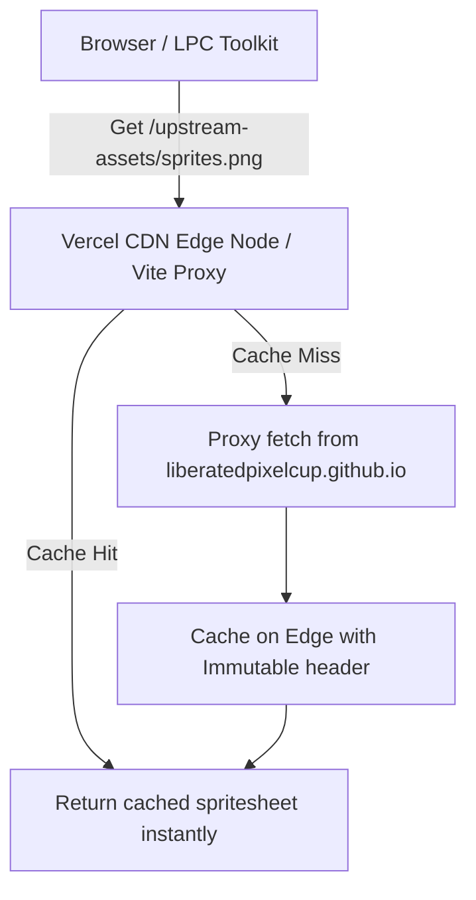

# Design Spec: Vercel Edge Cache Proxy for Upstream Assets

## 1. Context & Objective
When clicking "Randomize outfit", the application generates a random combination of 10+ layers. If these assets are not already cached locally, the browser has to fetch spritesheets from the external domain `liberatedpixelcup.github.io`.
This introduces significant lag (stretching the 0% progress bar wait time) due to:
* DNS lookup, TCP handshakes, and TLS negotiation with the external host.
* HTTP/1.1 connection limits per domain (typically 6 concurrent requests), causing subsequent requests to queue.

To resolve this without bloating the Git repository with hundreds of megabytes of spritesheet PNGs, this design implements **Vercel Edge Cache Proxying** (Solution 1 in Issue #40). We will redirect all upstream spritesheet requests to a relative, same-origin path (`/upstream-assets/`) and configure Vercel CDN/Vite to proxy and aggressively cache these requests.

---

## 2. Proposed Architectural Changes



### 2.1 Upstream Base URL Reconfiguration
We will change `UPSTREAM_SPRITESHEET_BASE_URL` in [asset-source.ts](file:///Users/william/gitRepo/lpc-toolkit-2026-1/packages/web/src/adapter/asset-source.ts) to resolve assets from `/upstream-assets/` relatively:

```typescript
export const UPSTREAM_SPRITESHEET_BASE_URL = '/upstream-assets/';
```

### 2.2 Vercel Edge Proxy Routing & Cache Headers (`vercel.json`)
We will configure Vercel to route `/upstream-assets/:path*` to `https://liberatedpixelcup.github.io/Universal-LPC-Spritesheet-Character-Generator/:path*` and apply aggressive caching headers:

* **Header**: `Cache-Control: public, max-age=31536000, immutable`

This ensures that once any user has fetched a spritesheet layer, Vercel caches it on global Edge CDN nodes for 1 year, making downstream requests from other users instantaneous.

### 2.3 Vite Local Development Proxy (`vite.config.ts`)
To prevent 404 errors during local development (`pnpm dev` or `vite`), we will configure Vite's development server proxy in [vite.config.ts](file:///Users/william/gitRepo/lpc-toolkit-2026-1/packages/web/vite.config.ts) to forward `/upstream-assets/` requests to the real remote generator base URL.

---

## 3. Detailed File Diffs

### 3.1 `packages/web/vercel.json`
```json
{
  "framework": "vite",
  "buildCommand": "pnpm build",
  "outputDirectory": "dist",
  "rewrites": [
    {
      "source": "/upstream-assets/:path*",
      "destination": "https://liberatedpixelcup.github.io/Universal-LPC-Spritesheet-Character-Generator/:path*"
    },
    {
      "source": "/(.*)",
      "destination": "/"
    }
  ],
  "headers": [
    {
      "source": "/upstream-assets/(.*)",
      "headers": [
        {
          "key": "Cache-Control",
          "value": "public, max-age=31536000, immutable"
        }
      ]
    }
  ]
}
```

### 3.2 `packages/web/vite.config.ts`
```typescript
  server: { 
    fs: { allow: ['../..'] },
    proxy: {
      '/upstream-assets': {
        target: 'https://liberatedpixelcup.github.io/Universal-LPC-Spritesheet-Character-Generator',
        changeOrigin: true,
        rewrite: (path) => path.replace(/^\/upstream-assets/, ''),
      },
    },
  },
```

### 3.3 `packages/web/src/adapter/asset-source.ts`
```typescript
export const UPSTREAM_SPRITESHEET_BASE_URL = '/upstream-assets/';
```

---

## 4. Verification and Testing Plan

### 4.1 Automated Tests
1. **Unit tests**: Run `rtk pnpm test` at the root directory to verify that `asset-source.test.ts` compiles and passes correctly, confirming that URL candidates correctly resolve with the new relative base URL.
2. **E2E & Parity tests**: Run `rtk pnpm test:e2e` and `rtk pnpm test:e2e:parity` to verify that our changes do not introduce regressions.

### 4.2 Manual Verification
1. Start the local Vite server: `rtk pnpm --filter @lpc-toolkit/web dev`
2. Navigate to `http://localhost:5173/?assetSource=upstream` in a browser.
3. Randomize the outfit multiple times.
4. Verify the Chrome DevTools Network Tab:
   * Verify that Spritesheet image requests are requested from `http://localhost:5173/upstream-assets/...` (not `liberatedpixelcup.github.io`).
   * Verify that status is `200 OK` and images render perfectly.
