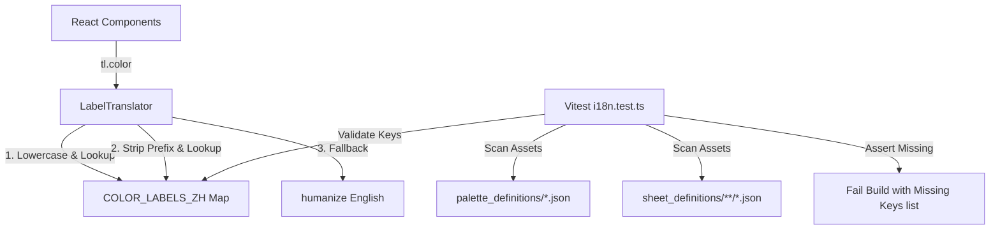

# Spec: Layer Selection i18n and Color Translation Validation Guard

## Status

- Date: 2026-06-11
- Status: Draft for review

## Problem

In the character generator UI, when selecting or configuring layers:
1. The available items in the expanded layer list (such as "Hood", "Leather Cap", etc.) are displayed using their raw English names rather than being localized.
2. The layer configuration header "Swap {typeName}" is hardcoded in English (e.g. "Swap hat").
3. Color options (like "BROWN", "LEATHER") are displayed as raw English names or capitalized text in the layer stack subheader and color picker tooltips/chips.
4. There is no test or CI check to alert developers if newly added sheet assets or palette colors are missing from the Chinese translation map.

## Goals

- Translate all item list option names (e.g. "Hood", "Leather Cap") in the expanded layer picker using the existing item name dictionary.
- Localize the "Swap {typeName}" headers appropriately for English and Traditional Chinese.
- Localize all color/variant names (like `brown`, `leather`, etc.) using a static lookup dictionary mapping standard LPC color palettes to Traditional Chinese.
- Handle prefixes dynamically (e.g., `lpcr.brown` should translate to the same value as `brown`).
- Add a Vitest safety guard that runs in local tests and CI, scanning the actual asset catalogs to fail the build if any color palette or variant name is missing its translation.
- Avoid external dependencies and leave `upstream/` and `packages/core` untouched.

## Non-Goals

- Dynamically generating Chinese translation values at runtime from upstream metadata.
- Re-translating item names that are already generated via the `gen-i18n` script.

## Architecture

We will implement a static map `COLOR_LABELS_ZH` in [i18n.ts](file:///Users/william/gitRepo/lpc-toolkit-2026-1/packages/web/src/i18n.ts) and expose it via the `LabelTranslator` interface's `color` method.

### 1. Translation Additions in `i18n.ts`

- Add `layer.swap` key to `TRANSLATIONS.en` (`'Swap {name}'`) and `TRANSLATIONS['zh-TW']` (`'更換{name}'`).
- Define `COLOR_LABELS_ZH` mapping all standard LPC colors, furs, metals, and custom palettes to Traditional Chinese:
  - **Body/Skin**: `ivory` (象牙色), `porcelain` (瓷白色), `peach` (桃色), `tawny` (茶褐色), `honey` (蜜黃色), `light` (淺膚色), `amber` (琥珀色), `olive` (橄欖色), `taupe` (灰褐色), `pale_green` (蒼綠色), `bright_green` (亮綠色), `dark_green` (深綠色), `zombie` (殭屍膚色), `zombie_green` (綠色殭屍膚色).
  - **Hair**: `ash_brown` (亞麻棕), `blonde` (金色), `chestnut` (板栗色), `platinum` (白金色), `raven` (烏黑色), `ruby` (紅寶石色), `silver` (銀色), `violet` (紫羅蘭色), `ash` (灰亞麻色), `sandy` (沙金色), `strawberry` (草莓金色), `gold` (金黃色), `ginger` (薑黃色), `carrot` (胡蘿蔔橘色), `redhead` (紅髮), `light_brown` (淺棕色), `dark_brown` (深棕色), `dark_gray` (深灰色).
  - **Fur**: `fur_black` (黑色毛皮), `fur_brown` (棕色毛皮), `fur_copper` (紅銅毛皮), `fur_gold` (金色毛皮), `fur_grey` (灰色毛皮), `fur_tan` (黃褐毛皮), `fur_white` (白色毛皮).
  - **Metal/Ceramic**: `brass` (黃銅色), `copper` (紅銅色), `iron` (鐵灰色), `steel` (鋼灰色), `ceramic` (陶瓷色), `bronze` (青銅色).
  - **Eyes**: `hazel` (淡褐色).
  - **Clothing/Accents**: `brown`, `leather`, `walnut`, `yellow`, `tan`, `orange`, `rose`, `maroon`, `red`, `pink`, `lavender`, `purple`, `blue`, `navy`, `teal`, `bluegray`, `forest`, `green`, `white`, `sky`, `slate`, `gray`, `black`, `charcoal`, `base`.
- Implement `LabelTranslator.color(value: string)`:
  - Standardize incoming string to lowercase.
  - Check full key in `COLOR_LABELS_ZH`.
  - Check stripped key (without dots/prefixes) in `COLOR_LABELS_ZH`.
  - Fall back to `humanize(value)`.

### 2. Component Updates

- **[layer-row.tsx](file:///Users/william/gitRepo/lpc-toolkit-2026-1/packages/web/src/components/layer-stack/layer-row.tsx)**:
  - In metadata line, change `{selection.variant}` to `{tl.color(selection.variant)}`.
  - Translate option item names: change `{it.name}` in button label and title tooltip to `{tl.itemName(it.name)}`.
  - Use `t('picker.incompatibleBodyType')` instead of hardcoded `'incompatible body type'`.
  - Replace `Swap {typeName}` with `t('layer.swap').replace('{name}', tl.category(typeName))`.
  - Pass `tl` down to `<ColorPicker>` component.
- **[color-picker.tsx](file:///Users/william/gitRepo/lpc-toolkit-2026-1/packages/web/src/components/color-picker.tsx)**:
  - Add `tl: LabelTranslator` to properties.
  - In `recolors` buttons, translate tooltips and aria-labels via `tl.color(opt.value)`.
  - In `variants` buttons, translate text via `tl.color(opt.value)`.
  - Translate the style/color label via `t('picker.color')` or similar in the caller.

### 3. Safety Guard Validation Test

Add a new test block inside [i18n.test.ts](file:///Users/william/gitRepo/lpc-toolkit-2026-1/packages/web/test/i18n.test.ts):
- Use `node:fs` and `node:path` to discover all palette JSON files in `assets/palette_definitions`.
- Load them, parse their keys, and extract all palette color names.
- Read all JSON files in `assets/sheet_definitions` to parse their `variants` array and extract all variant names.
- Verify that every single extracted color and variant key is mapped in `COLOR_LABELS_ZH` (matching either the full name or prefix-stripped name).
- If any keys are missing, compile them into a list and fail the test via `expect.fail()` or standard assertions, printing the list of missing keys.

## Testing

1. Run existing tests to ensure no regressions:
   `pnpm --filter @lpc-toolkit/web test`
2. Write unit tests in [i18n.test.ts](file:///Users/william/gitRepo/lpc-toolkit-2026-1/packages/web/test/i18n.test.ts) to verify `tl.color` translates values and handles prefixed values correctly.
3. Confirm the catalog scanning test passes and catches any simulated missing translation key.

## Success Criteria

- Selecting any layer displays option names (e.g., "Hood", "Leather Cap") in Traditional Chinese when the locale is `zh-TW`.
- The swap title (e.g., "更換帽子") and incompatible tooltips are correctly localized.
- Selected color details (e.g. "帽子 · 棕色") and color picker chips are translated.
- Any missing translation key for new assets or palettes triggers a test failure in local builds and CI.
- No dependencies are added and `packages/core` remains clean.
